# Comparison of Crime Concentration Measures

The purposes of these analyses are twofold:

- apply established methodologies for measuring crime concentration to our data and present the results
- critique the methodologies from both a practical and theoretical perspective

## Lorenz and naive Gini

:material-arrow-right: [`lorenz-curve.ipynb`](https://github.com/safer-streets/safer-streets-eda/blob/main/lorenz-curve.ipynb)

Firstly taking crime data for different crime types and seeing how the concentration varies by
crime type over the entire (3 year) period.

Unsurprisingly, shoplifting - which requires shops - is the most concentrated category.

Looking at the magnitude and temporal stability - calculating the Gini coefficient for each month in the data, and
comparing this to *i.i.d.* random data, using both irregular and similarly-sized regular spatial units, reveals some
important issues:

- Statistical geographies (which control for population) exhibit lower concentration than regular ones, since controlling
for population has a spatial averaging effect.
- there is a seasonal variation **in concentration** which is more pronounced for statistical geographies
- Gini significantly overestimates concentration as evidenced by the random data

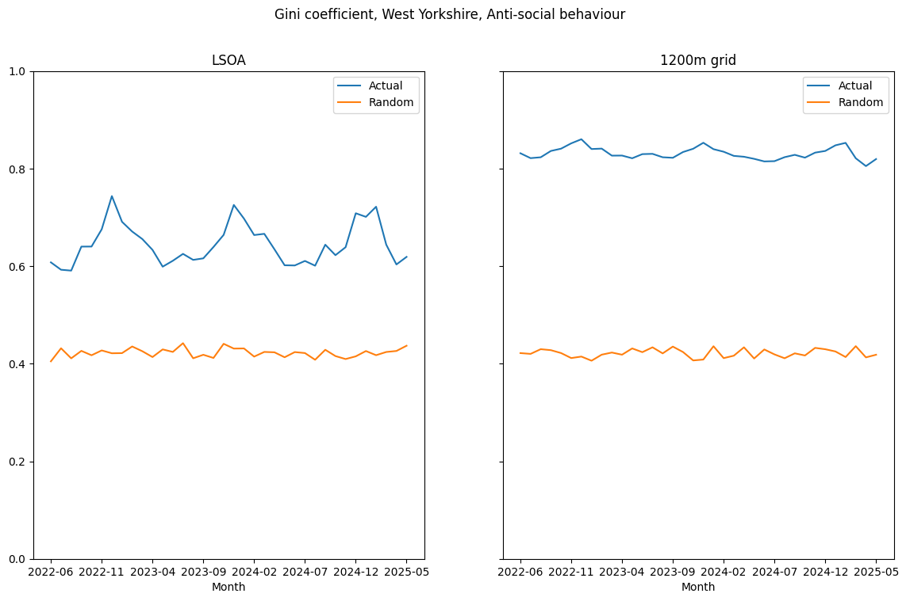

Further investigation on Gini, and adjustments to it, can be found in the section [below](#adjusted-gini)

## Clumpiness index

:material-arrow-right: [`clumpiness.ipynb`](https://github.com/safer-streets/safer-streets-eda/blob/main/clumpiness.ipynb)

Adepeju *et al* describe a "clumpiness index" which is available in the proprietary and closed-source FRAGSTATS package.
A quick analysis reveals some drawbacks to the measure (see below). For our purposes we made the following requirements
for a useful clumpiness measure:

- essential:
    - scale invariant (i.e. adimensionless quantity)
    - intuitive scale with known bounds, e.g. 0 for completely dispersed, 1 for a single cluster with minimal perimeter
- desirable
    - agnostic to the shape of the (regular) geometry
    - works with irregular geometries (e.g. census geographies)

The clumpiness index as described by Adepeju satisfies only one of these requirements. While we can replicate their example, it
is inconsistent with the FRAGSTATS documentation, requires a regular (square) grid, is potentially prone to discontinuities
The value is hard to interpret and is rather counter intuitively impacted by the size of the background surrounding the
features.

As a result we decided to create our own clumpiness measure. A simple area/perimeter ratio is not scale invariant,
nor is it intuitive.

We argue that scale is integral to any measure: consider two disjoint squares of side $x$. At a length scale of $x$
this is a completely dispersed arrangement - two separate "units" and a "clumpiness" value of 0 would be appropriate.
However, consider the same geometry at a scale of $x/2$ - it becomes two clusters of 4 "unit" squares and is thus, to
some degree, clumpy. As the spatial scale is decrease this arrangement must be considered to be more and more clumped.

Conversely, applying a large length scale (say $10x$) on this arrangement becomes somewhat meaningless, so the length
scale has a lower bound approximately represented by the smallest feature of the geometry.

Having now established that a representative length scale must be supplied to any unambiguous clumpiness calculation,
it can also be used to render quantities dimensionless (between length and areal units)

To this end we compute lower and upper bounds, in units of the length scale $s$, for the perimeter of a square-based
geometry with a given area $A$.

$$
P_{min} = 4\sqrt{A}
$$

and the upper bound corresponds to $N=A/s^2$ disjoint length-unit squares:

$$
P_{max} = 4sN = \frac{4A}{s}
$$

The clumpiness - the perimeter of the geometry in question - must then lie in between these two values (assuming a
valid length scale has been chosen) and can be normalised:

$$
CI = \frac{P_{max} - P}{P_{max} - P_{min}}
$$

thus yielding a value of 0 for fully disjoint geometries (at the given length scale) and 1 for a geometry that minimises
the perimeter (a square in this case)

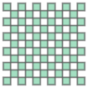{align=left} 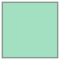{align=right}
For a more practical demonstration, we compute the clumpiness of geometries starting with a fully-disjoint 11x11
geometry (left), gradually filling in empty squares until left with a single large square (right). The resulting curve
is:

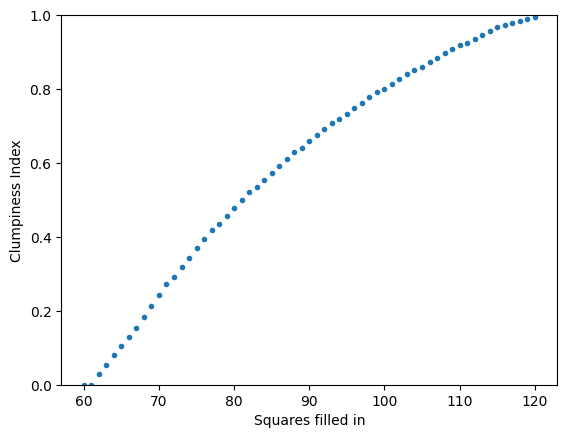

This index can easily be applied to non-square regular geometries and even irregular geometries.

When applying this measure to real data, we can apply it in a number of ways: firstly measuring the clumpiness of all
spatial units that contain a crime in a given period, but also filtering spatial units to cover only the top $N%$ of
crimes - that is, the smallest number of spatial units required to capture $N%$ of crime.

Applying this to real data shows that clumpiness index is very stable from month to month, decreases as we filter crimes,
and increases with coarser grids:

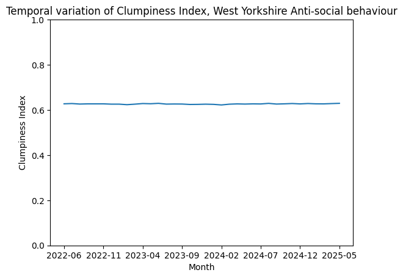

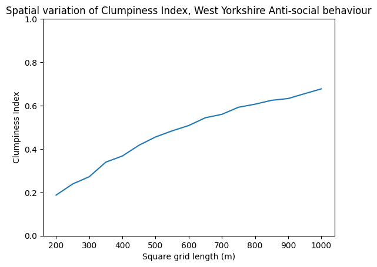

With results like this it's open to debate whether this measure is particularly useful or insightful. It doesn't detect
seasonal variation in concentration, at least at the scale tested (some other measures do), it's not scale-invariant
and the spatial trend is one we'd expect for any input. If temporal and/or spatial scales can be found that maximise
the clumpiness index, then it may become useful.

## KDE

:material-arrow-right: [`kde-sampling.ipynb`](https://github.com/safer-streets/safer-streets-eda/blob/main/kde-sampling.ipynb)

KDE sampling allows us to create a spatial distribution for crimes based on sampled location data (blue points below).
The resulting distribution can then be sampled to synthesise similarly-distributed crimes (red points).

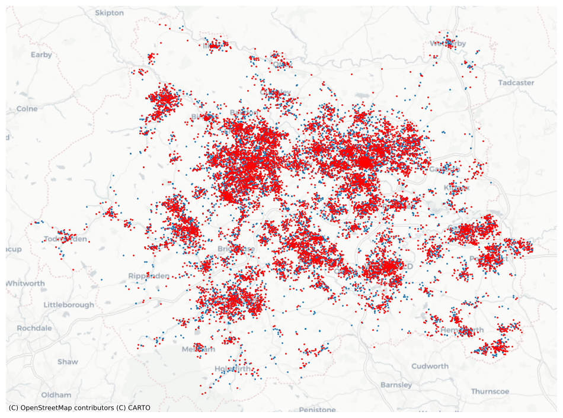

However the synthesised crimes tend to be slightly more spread out than the original data, and the sampling doesn't take
into account geographical features. This approach does not appear to have much use for our purposes, at least for now.

## Adjusted Gini

:material-arrow-right: [`gini.ipynb`](https://github.com/safer-streets/safer-streets-eda/blob/main/gini.ipynb)

### Rationale

The Gini coefficient measures the difference between the observed Lorenz curve and the line $y=x$, which corresponds to
a perfectly even distribution (of crimes) across all possible states (locations). If we consider crimes to be *i.i.d.*
Poisson processes for each state, then a perfectly even distribution is actually a (very) low entropy, (highly)
improbable, state for the system. Consider $C$ crimes occuring in $N$ units. Since we can't have fractional crimes,
a perfectly even distribution is only possible if $C$ is an integer multiple of $N$.

Taking the case where $C=N$, the probability of one crime per state is given by $N!/N^N$, which very quickly vanishes as
$N$ increases, so much so that if N is 750 or more, the probability cannot be represented in double precision arithmetic.

N    | p
----:|-------:
10   | 0.0003
30   | 1e-12
100  | 9e-43
300  | 2e-129
1000 | ~0 (not representable)

Since crime analysis would typically have $N\gg 100$ and also because typically $C<N$, this does not seem to be a suitable
reference for a concentration calculation. Bernasco and Steenbeck have gone some way to address this, suggesting a
reference described by the line $y=\text{max}(Nx/C,1)$, which is the equivalent of $C$ states containing 1 crime, and $N-C$
states empty. However this state is also an improbable low entropy state with the chance of occurrence given by
$\frac{N!(C-N)!}{N^C}$

N    |C    | $\lambda$ | p
----:|----:|----------:|-------:
300  | 30  |       0.1 | 0.2
300  | 60  |       0.2 | 0.002
300  | 150 |       0.5 | 1e-20
1000 | 100 |       0.1 | 0.006
1000 | 200 |       0.2 | 5e-10
1000 | 500 |       0.5 | 3e-67

which is clearly a big improvement when $C\ll N$, but notably less so when $C$ is larger. But we can just use the highest
entropy state as the reference curve, which just happens to be the scaled PDF of the (assumed) Poisson distribution -
in other words there will likely be a mixture of counts in each state, depending in the intensity ($C/N$) of the Poisson
process. The table below lists the expected number of states with a specific crime count, for 100 crimes at varying
intensities:

$\lambda$ |N    | empty | 1 crime | 2 crimes | 3 crimes | 4 crimes
---------:|----:|-------:|-----:|-----:|----:|---:
      0.1 |1000 |  904.8 | 90.5 | 4.5
      0.2 | 500 |  409.4 | 81.9 | 8.2  | 0.5
      0.5 | 200 |  121.3 | 60.7 | 15.2 | 2.5 | 0.3

### Implementation

The first step is simply to check how closely that purely random data matches a Poisson distribution that can
subsequently be used to create a baseline Lorenz curve. There are two options - randomly assigning points within a
boundary, then aggregating to spatial units, or directly sampling the spatial units.

There are pronounced differences between the two approaches which are illustrated in the graphs below. When the spatial
units have different sizes (LSOAs in this case), in the first approach larger spatial units will typically have higher counts (bottom graph),
and even regular units that intersect the boundary will have lower counts (top graph).

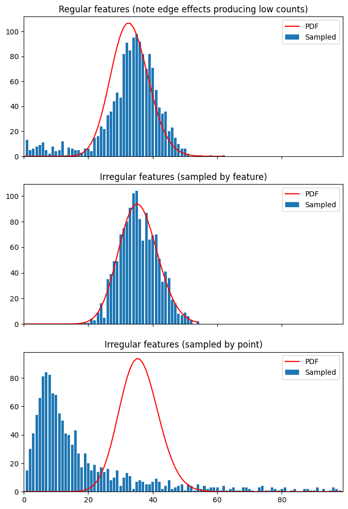

The implication is that crimes are no longer identically distributed across spatial units, and if this is the case then
it is not valid to use a Poisson distribution as a baseline Lorenz curve. More on this in the
[next section](#poisson-gamma).

However, assuming we do have independent and identical distributions across spatial units, the "null hypothesis" Lorenz
curve is given by

$$
L_0(x) = \frac{1}{\lambda}\int_0^x{Q(p; \lambda) dp}
$$

where $Q(p;\lambda)$ is the inverse CDF of the Poisson distribution. The curve is piecewise-linear and continuous and
is described by the origin and the set of points

$$
\left\{ (F(k; \lambda), F(k-1; \lambda)) \mid k \in \mathbb{N}_0 \right\}
$$

where $F(k; \lambda)$ is the CDF.

The figure below plots this curve (blue line) alongside real crime data (green) as well as the naive Gini baseline
(black dotted line) and the limit proposed by Bernasco and Steenbeck (described above, orange dotted line). The
Poisson intensity in this case is approximately $1\over3$ - in other words *at least* 2/3 of spatial units are crime-
free.

The naive Gini value is (twice) the area bounded by the green and black dotted lines. Bernasco and Steenback's adjusted
value is twice the significantly smaller area bounded by the orange rather than the black dotted line.

Our proposal is to use the even smaller red shaded area ($A_0 - A$, where $A_0$ and $A$ are the areas above the blue and
green curves respectively), either directly or as a proportion of the combined red and grey shaded areas ($A_0$)[^1].
Unlike the other baselines, this is not a hard limit: it *is* possible for the data to be more dispersed than would be
expected randomly, so negative values are possible.

[^1]: this measure has more interpretable bounds

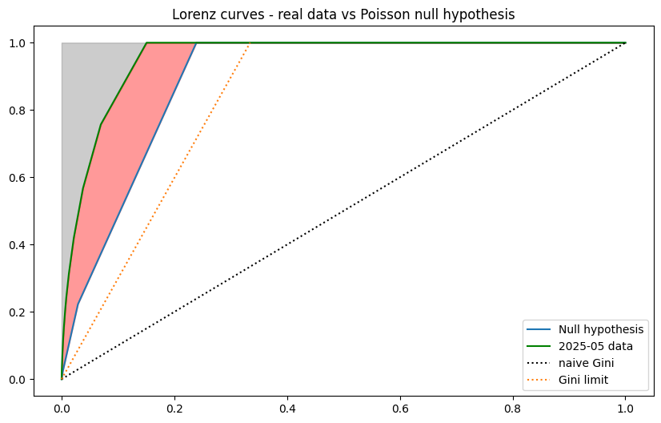

Looking at how this measure would behave for a range of Poisson intensities. Maximal concentration (all crime in same
location) correspond to $A_{min} which is always zero, yielding an adjusted Gini of 1. Maximal dispersion areas
$A_{max}$ are always positive and peak at 0.5 (essentially the black dotted line). The red shaded area depicts the
possible range of adjusted Gini values.

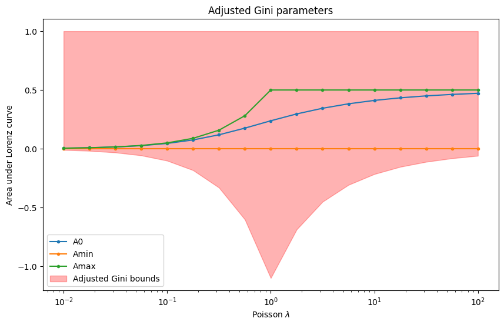

Applying this to real monthly crime data over 3 years, using a regular 500m grid shows a marked difference between
naive and adjusted Gini, with the adjusted value lower (as expected) and also accentuates the seasonality of concentration

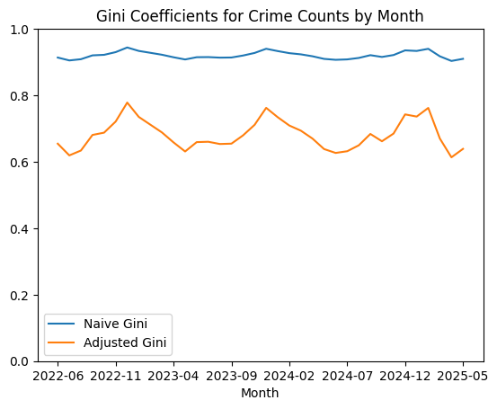

Finally, using random data sampled with varying weights to create greater and greater concentration, we look at how the
Lorenz curves and the Gini measures vary:

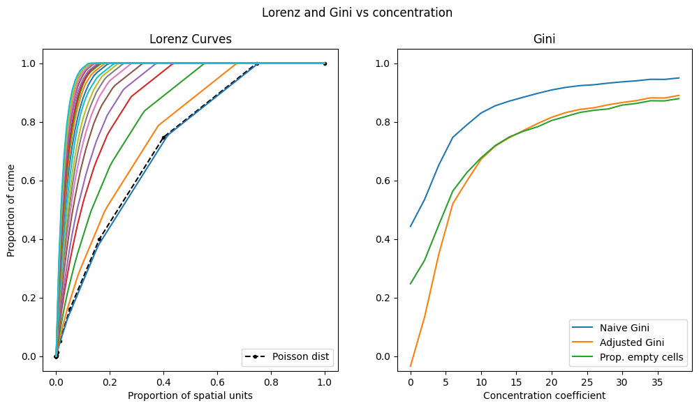

Note that in this example the number of features is smaller than the number of crimes - the Bernasco & Steenback Gini
would not be any different to naive Gini.

## Poisson-Gamma

:material-arrow-right: [`poisson-gamma.ipynb`](https://github.com/safer-streets/safer-streets-eda/blob/main/poisson-gamma.ipynb)

TODO

- need to revisit spatial invariance and concentration sections in light of non-i.i.d.
- Poisson-Gamma based lorenz baseline