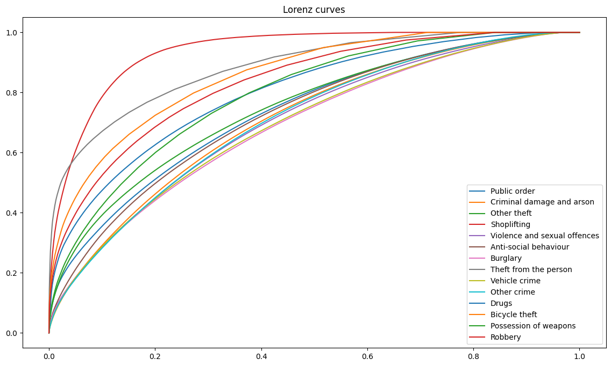

# Comparison of Concentration Measures

The purposes of these analyses are twofold:

- apply established methodologies for measuring crime concentration
- critique the methodologies from both a practical and theoretical perspective

## Lorenz and naive Gini

Firstly, [lorenz-curves.ipynb]() takes crime data for different crime types and look at how the concentration varies by
crime type over the entire period.

## Clumpiness index (of top n %)

## Adjusted Gini

  - [x] gradually cluster random data and demonstrate how Adj Gini changes more than naive.
  - [x] is random data accurately modelled by a Poisson dist? (c.f negative binomial) - yes, with caveats
  - [ ] discuss the effect of uneven distributions  (spatial unit size, intensity)

## KDE

## Poisson-Gamma

